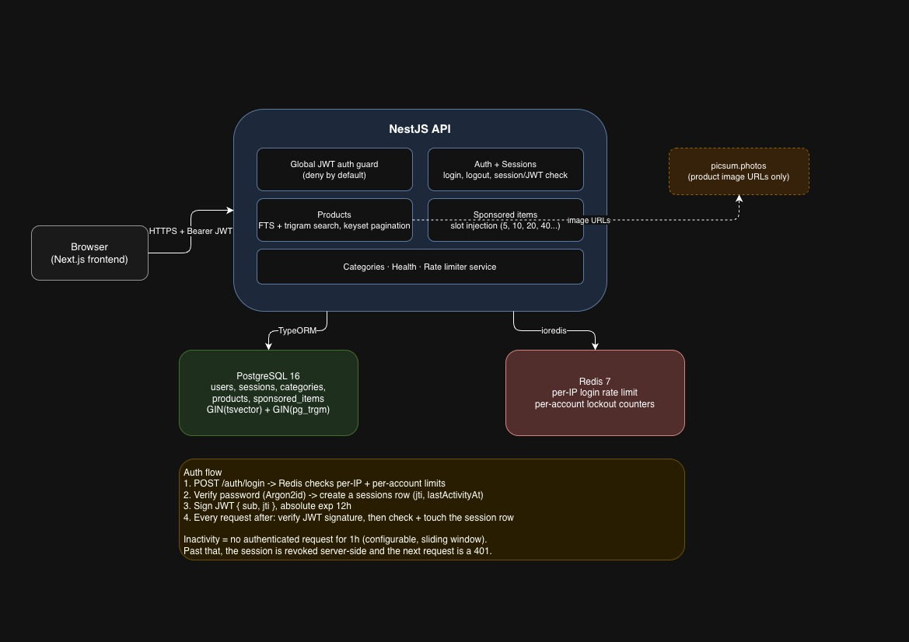

### BACKEND ARCHITECTURE DOCUMENT


### HOW TO RUN
- <b>ADD THE .ENV FILE ON ROOT LEVEL (SHARED AS ATTACHMENT OVER EMAIL) </b>
- Run ```docker compose up --build```
- It'll seed the DB, no need to run ```npm i``` in every folder
- Once successfully compiled redirect to ```http://localhost:3001/login```
- USER NAME & PASSWORD: bob & Password@2026

### Architectural Choices
- Implemented PASSPORT auth for security
- Redis-backed login rate limiting.
- Per-IP request limiting.
- Account lockout after repeated failed logins.
- Generic authentication error responses to prevent account enumeration.

### Search Feature
- Full-text search (`tsvector` + GIN index)
- Fuzzy typo search (`pg_trgm`)
- Category filtering
- Infinite scrolling
- Offset pagination for search results
- Keyset pagination for browsing

### Future Improvements
- Refresh tokens
- Sponsored click tracking
- Integration tests
- Improved sponsored product rotation
- Vector search
- Frontend UI is not a lucrative UI, but it satisfies the requirements, we can work on it as future enhancements

### What is not done
- Unit Testing, (Time constraints)

### ATTACHED POSTMAN COLLECTION FOR REFERENCE
PATH: 

